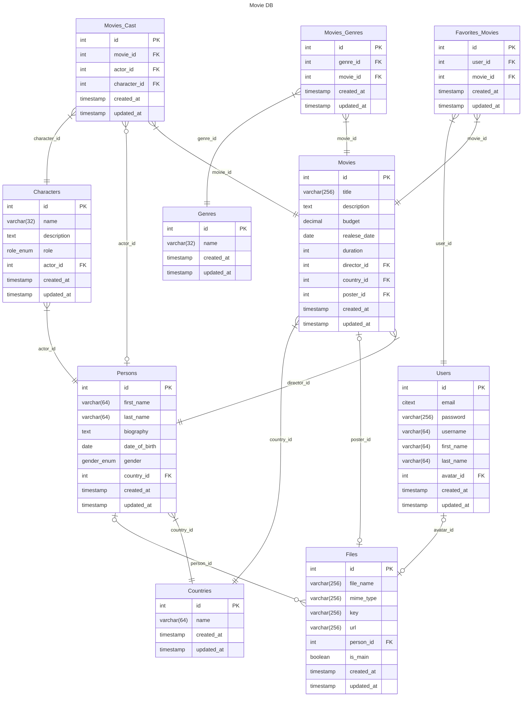

# db_homework

```mermaid
---
title: Movie DB
---
erDiagram
    Users
    Users |o--o| Files : avatar_id
       Users {
        int id PK
        citext email
        varchar(256) password
        varchar(64) username
        varchar(64) first_name
        varchar(64) last_name
        int avatar_id FK
        timestamp created_at
        timestamp updated_at
    }
    Files {
        int id PK
        varchar(256) file_name
        varchar(256) mime_type
        varchar(256) key
        varchar(256) url
        int person_id FK
        boolean is_main
        timestamp created_at
        timestamp updated_at
    }
    Movies }|--|| Persons:director_id
    Movies o|--|o Files:poster_id
    Movies }|--|| Countries : country_id
    Movies{
       int id PK
       varchar(256) title
       text description
       decimal budget
       date realese_date
       int duration
       int director_id FK
       int country_id FK
       int poster_id FK
       timestamp created_at
       timestamp updated_at

    }
    Persons }|--|| Countries : country_id
    Persons o|--o{ Files : person_id
    Persons{
        int id PK
        varchar(64) first_name
        varchar(64) last_name
        text biography
        date date_of_birth
        gender_enum gender
        int country_id FK
        timestamp created_at
        timestamp updated_at   
    }
    Countries{
        int id PK
        varchar(64) name
        timestamp created_at
        timestamp updated_at
    }
    Genres{
        int id PK
        varchar(32) name
        timestamp created_at
        timestamp updated_at
    }
    Movies_Genres }|--|| Movies: movie_id
    Movies_Genres }|--|| Genres: genre_id
    Movies_Genres{
        int id PK 
        int genre_id FK
        int movie_id FK
        timestamp created_at
        timestamp updated_at
    }
    Characters }|--|| Persons:actor_id
    Characters{
        int id PK 
        varchar(32) name
        text description
        role_enum role
        int actor_id FK
        timestamp created_at
        timestamp updated_at
    }
    Favorites_Movies }|--|| Movies:movie_id
    Favorites_Movies }|--|| Users:user_id
    Favorites_Movies{
        int id PK 
        int user_id FK
        int movie_id FK
        timestamp created_at
        timestamp updated_at
    }
    Movies_Cast }|--|| Movies:movie_id
    Movies_Cast }o--|o Persons:actor_id
    Movies_Cast }|--|| Characters:character_id
    Movies_Cast{
    int id PK 
    int movie_id FK
    int actor_id FK
    int character_id FK
    timestamp created_at
    timestamp updated_at
    }

```
